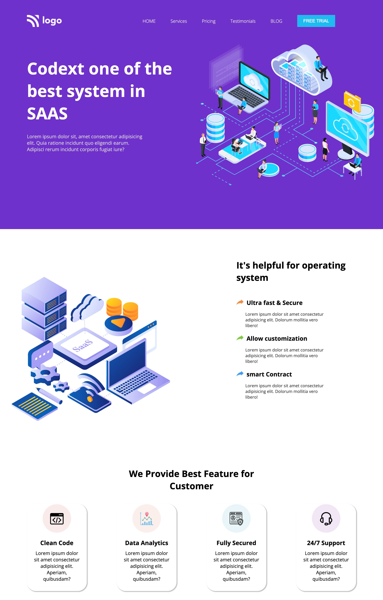

# SAAS landing page

- This is a SAAS landing page, made using html and css 

## Built with

- Semantic HTML5 markup
- CSS custom properties
- Flexbox
- media query

## What I learned
- I learned how to arrange components with flexbox, usage of media query, usage of flex wrap where ever needed and solved many bugs while building webpage.

## Time taken
- It took me around 5 hours to built this website from scratch.

## Links
- [live demo](https://saas-landing-page-by-shriram.netlify.app/)
- [source](https://github.com/RAM844/SAAS-landing-page)

## Contact me
- GitHub - [@RAM844](https://github.com/RAM844)
- Twitter - [@ShriramBalaji7](https://www.twitter.com/ShriramBalaji7)

## Screenshot

